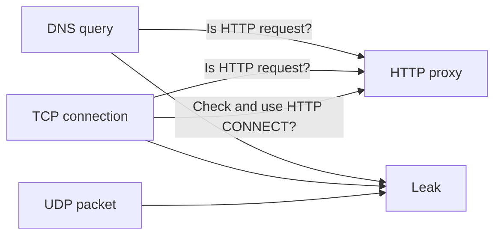
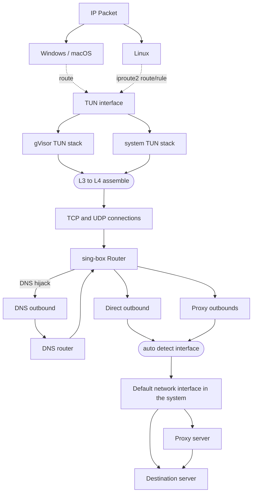

# Client

### :material-ray-start: Introduction

For a long time, the modern usage and principles of proxy clients
for graphical operating systems have not been clearly described.
However, we can categorize them into three types:
system proxy, firewall redirection, and virtual interface.

### :material-web-refresh: System Proxy

Almost all graphical environments support system-level proxies,
which are essentially ordinary HTTP proxies that only support TCP.

| Operating System / Desktop Environment       | System Proxy                         | Application Support |
|:---------------------------------------------|:-------------------------------------|:--------------------|
| Windows                                      | :material-check:                     | :material-check:    |
| macOS                                        | :material-check:                     | :material-check:    |
| GNOME/KDE                                    | :material-check:                     | :material-check:    |
| Android                                      | ROOT or adb (permission) is required | :material-check:    |
| Android/iOS (with sing-box graphical client) | via `tun.platform.http_proxy`        | :material-check:    |

As one of the most well-known proxy methods, it has many shortcomings:
many TCP clients that are not based on HTTP do not check and use the system proxy.
Moreover, UDP and ICMP traffics bypass the proxy.



### :material-wall-fire: Firewall Redirection

This type of usage typically relies on the firewall or hook interface provided by the operating system,
such as Windows’ WFP, Linux’s redirect, TProxy and eBPF, and macOS’s pf.
Although it is intrusive and cumbersome to configure,
it remains popular within the community of amateur proxy open source projects like V2Ray,
due to the low technical requirements it imposes on the software.

### :material-expansion-card: Virtual Interface

All L2/L3 proxies (seriously defined VPNs, such as OpenVPN, WireGuard) are based on virtual network interfaces,
which is also the only way for all L4 proxies to work as VPNs on mobile platforms like Android, iOS.

The sing-box inherits and develops clash-premium’s TUN inbound (L3 to L4 conversion)
as the most reasonable method for performing transparent proxying.



## :material-cellphone-link: Examples

### Basic TUN usage for Chinese users

=== ":material-numeric-4-box: IPv4 only"

    ```json
    {
      "dns": {
        "servers": [
          {
            "tag": "google",
            "address": "tls://8.8.8.8"
          },
          {
            "tag": "local",
            "address": "223.5.5.5",
            "detour": "direct"
          }
        ],
        "rules": [
          {
            "outbound": "any",
            "server": "local"
          }
        ],
        "strategy": "ipv4_only"
      },
      "inbounds": [
        {
          "type": "tun",
          "inet4_address": "172.19.0.1/30",
          "auto_route": true,
          "strict_route": false
        }
      ],
      "outbounds": [
        // ...
        {
          "type": "direct",
          "tag": "direct"
        },
        {
          "type": "dns",
          "tag": "dns-out"
        }
      ],
      "route": {
        "rules": [
          {
            "protocol": "dns",
            "outbound": "dns-out"
          },
          {
            "geoip": [
              "private"
            ],
            "outbound": "direct"
          }
        ],
        "auto_detect_interface": true
      }
    }
    ```

=== ":material-numeric-6-box: IPv4 & IPv6"

    ```json
    {
      "dns": {
        "servers": [
          {
            "tag": "google",
            "address": "tls://8.8.8.8"
          },
          {
            "tag": "local",
            "address": "223.5.5.5",
            "detour": "direct"
          }
        ],
        "rules": [
          {
            "outbound": "any",
            "server": "local"
          }
        ]
      },
      "inbounds": [
        {
          "type": "tun",
          "inet4_address": "172.19.0.1/30",
          "inet6_address": "fdfe:dcba:9876::1/126",
          "auto_route": true,
          "strict_route": false
        }
      ],
      "outbounds": [
        // ...
        {
          "type": "direct",
          "tag": "direct"
        },
        {
          "type": "dns",
          "tag": "dns-out"
        }
      ],
      "route": {
        "rules": [
          {
            "protocol": "dns",
            "outbound": "dns-out"
          },
          {
            "geoip": [
              "private"
            ],
            "outbound": "direct"
          }
        ],
        "auto_detect_interface": true
      }
    }
    ```

=== ":material-domain-switch: FakeIP"

    ```json
    {
      "dns": {
        "servers": [
          {
            "tag": "google",
            "address": "tls://8.8.8.8"
          },
          {
            "tag": "local",
            "address": "223.5.5.5",
            "detour": "direct"
          },
          {
            "tag": "remote",
            "address": "fakeip"
          }
        ],
        "rules": [
          {
            "outbound": "any",
            "server": "local"
          },
          {
            "query_type": [
              "A",
              "AAAA"
            ],
            "server": "remote"
          }
        ],
        "fakeip": {
          "enabled": true,
          "inet4_range": "198.18.0.0/15",
          "inet6_range": "fc00::/18"
        },
        "independent_cache": true
      },
      "inbounds": [
        {
          "type": "tun",
          "inet4_address": "172.19.0.1/30",
          "inet6_address": "fdfe:dcba:9876::1/126",
          "auto_route": true,
          "strict_route": true
        }
      ],
      "outbounds": [
        // ...
        {
          "type": "direct",
          "tag": "direct"
        },
        {
          "type": "dns",
          "tag": "dns-out"
        }
      ],
      "route": {
        "rules": [
          {
            "protocol": "dns",
            "outbound": "dns-out"
          },
          {
            "geoip": [
              "private"
            ],
            "outbound": "direct"
          }
        ],
        "auto_detect_interface": true
      }
    }
    ```

### Traffic bypass usage for Chinese users

=== ":material-dns: DNS rules"

    !!! info
    
        DNS rules are optional if FakeIP is used.

    ```json
    {
      "dns": {
        "servers": [
          {
            "tag": "google",
            "address": "tls://8.8.8.8"
          },
          {
            "tag": "local",
            "address": "223.5.5.5",
            "detour": "direct"
          }
        ],
        "rules": [
          {
            "outbound": "any",
            "server": "local"
          },
          {
            "clash_mode": "Direct",
            "server": "local"
          },
          {
            "clash_mode": "Global",
            "server": "google"
          },
          {
            "type": "logical",
            "mode": "and",
            "rules": [
              {
                "geosite": "geolocation-!cn",
                "invert": true
              },
              {
                "geosite": [
                  "cn",
                  "category-companies@cn"
                ],
              }
            ],
            "server": "local"
          }
        ]
      }
    }
    ```

=== ":material-dns: DNS rules (1.8.0+)"

    !!! info
    
        DNS rules are optional if FakeIP is used.

    ```json
    {
      "dns": {
        "servers": [
          {
            "tag": "google",
            "address": "tls://8.8.8.8"
          },
          {
            "tag": "local",
            "address": "223.5.5.5",
            "detour": "direct"
          }
        ],
        "rules": [
          {
            "outbound": "any",
            "server": "local"
          },
          {
            "clash_mode": "Direct",
            "server": "local"
          },
          {
            "clash_mode": "Global",
            "server": "google"
          },
          {
            "type": "logical",
            "mode": "and",
            "rules": [
              {
                "rule_set": "geosite-geolocation-!cn",
                "invert": true
              },
              {
                "rule_set": [
                  "geosite-cn",
                  "geosite-category-companies@cn"
                ]
              }
            ],
            "server": "local"
          }
        ]
      },
      "route": {
        "rule_set": [
          {
            "type": "remote",
            "tag": "geosite-cn",
            "format": "binary",
            "url": "https://raw.githubusercontent.com/SagerNet/sing-geosite/rule-set/geosite-cn.srs"
          },
          {
            "type": "remote",
            "tag": "geosite-geolocation-!cn",
            "format": "binary",
            "url": "https://raw.githubusercontent.com/SagerNet/sing-geosite/rule-set/geosite-geolocation-!cn.srs"
          },
          {
            "type": "remote",
            "tag": "geosite-category-companies@cn",
            "format": "binary",
            "url": "https://raw.githubusercontent.com/SagerNet/sing-geosite/rule-set/geosite-category-companies@cn.srs"
          }
        ]
      }
    }
    ```

=== ":material-router-network: Route rules"

    ```json
    {
      "outbounds": [
        {
          "type": "direct",
          "tag": "direct"
        },
        {
          "type": "block",
          "tag": "block"
        }
      ],
      "route": {
        "rules": [
          {
            "type": "logical",
            "mode": "or",
            "rules": [
              {
                "protocol": "dns"
              },
              {
                "port": 53
              }
            ],
            "outbound": "dns"
          },
          {
            "geoip": "private",
            "outbound": "direct"
          },
          {
            "clash_mode": "Direct",
            "outbound": "direct"
          },
          {
            "clash_mode": "Global",
            "outbound": "default"
          },
          {
            "type": "logical",
            "mode": "or",
            "rules": [
              {
                "port": 853
              },
              {
                "network": "udp",
                "port": 443
              },
              {
                "protocol": "stun"
              }
            ],
            "outbound": "block"
          },
          {
            "type": "logical",
            "mode": "and",
            "rules": [
              {
                "geosite": "geolocation-!cn",
                "invert": true
              },
              {
                "geosite": [
                  "cn",
                  "category-companies@cn"
                ],
                "geoip": "cn"
              }
            ],
            "outbound": "direct"
          }
        ]
      }
    }
    ```

=== ":material-router-network: Route rules (1.8.0+)"

    ```json
    {
      "outbounds": [
        {
          "type": "direct",
          "tag": "direct"
        },
        {
          "type": "block",
          "tag": "block"
        }
      ],
      "route": {
        "rules": [
          {
            "type": "logical",
            "mode": "or",
            "rules": [
              {
                "protocol": "dns"
              },
              {
                "port": 53
              }
            ],
            "outbound": "dns"
          },
          {
            "ip_is_private": true,
            "outbound": "direct"
          },
          {
            "clash_mode": "Direct",
            "outbound": "direct"
          },
          {
            "clash_mode": "Global",
            "outbound": "default"
          },
          {
            "type": "logical",
            "mode": "or",
            "rules": [
              {
                "port": 853
              },
              {
                "network": "udp",
                "port": 443
              },
              {
                "protocol": "stun"
              }
            ],
            "outbound": "block"
          },
          {
            "type": "logical",
            "mode": "and",
            "rules": [
              {
                "rule_set": "geosite-geolocation-!cn",
                "invert": true
              },
              {
                "rule_set": [
                  "geoip-cn",
                  "geosite-cn",
                  "geosite-category-companies@cn"
                ]
              }
            ],
            "outbound": "direct"
          }
        ],
        "rule_set": [
          {
            "type": "remote",
            "tag": "geoip-cn",
            "format": "binary",
            "url": "https://raw.githubusercontent.com/SagerNet/sing-geoip/rule-set/geoip-cn.srs"
          },
          {
            "type": "remote",
            "tag": "geosite-cn",
            "format": "binary",
            "url": "https://raw.githubusercontent.com/SagerNet/sing-geosite/rule-set/geosite-cn.srs"
          },
          {
            "type": "remote",
            "tag": "geosite-geolocation-!cn",
            "format": "binary",
            "url": "https://raw.githubusercontent.com/SagerNet/sing-geosite/rule-set/geosite-geolocation-!cn.srs"
          },
          {
            "type": "remote",
            "tag": "geosite-category-companies@cn",
            "format": "binary",
            "url": "https://raw.githubusercontent.com/SagerNet/sing-geosite/rule-set/geosite-category-companies@cn.srs"
          }
        ]
      }
    }
    ```